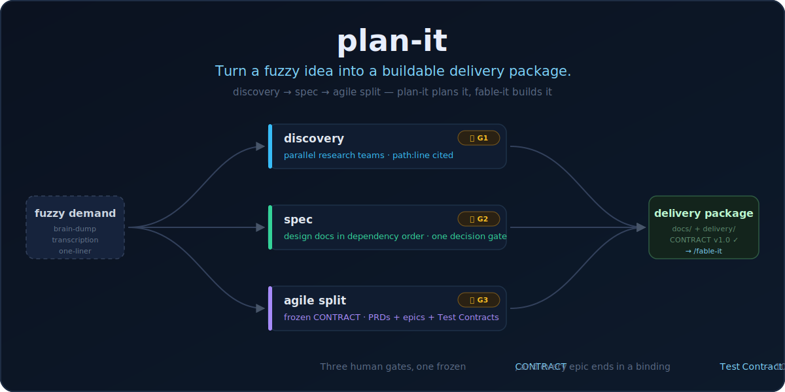
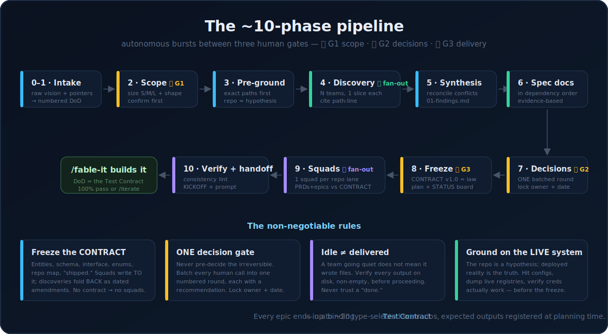

<div align="center">

<h1>plan-it</h1>

<h3>
  <strong>Turn a fuzzy idea into a buildable delivery package.</strong>
</h3>

<p>
  Hand it a brain-dump, a transcription, or a one-liner.<br>
  <strong>Get back specs, PRDs, epics — and a binding Test Contract per epic.</strong>
</p>

<p>
  <em>The planning front-end to <a href="https://github.com/DevOtts/fable-it">/fable-it</a>: plan-it plans it, fable-it builds it.</em>
</p>

<a href="#how-it-works">
  
</a>

<p>
  <a href="#installation"></a>
  <a href="https://opensource.org/licenses/MIT"></a>
  <a href="https://claude.ai/code"></a>
  <a href="#platform-compatibility"></a>
  <a href="https://github.com/DevOtts"></a>
</p>

<p>
  <a href="#installation">Install</a>
  &nbsp;·&nbsp;
  <a href="#the-bottleneck-it-kills">Why</a>
  &nbsp;·&nbsp;
  <a href="#how-it-works">How it works</a>
  &nbsp;·&nbsp;
  <a href="#the-test-contract">The Test Contract</a>
  &nbsp;·&nbsp;
  <a href="#whats-inside">What's inside</a>
  &nbsp;·&nbsp;
  <a href="#platform-compatibility">Platforms</a>
</p>

> [!NOTE]
> **Built for agentic delivery** — the disciplined front-half of the lifecycle that ends exactly where an autonomous build agent begins.

<br>
</div>

Everyone has learned that agents can *build*. What still fails, quietly and expensively, is the step before: turning "here's roughly what I want" into something an agent can build **unattended**. Paste a fuzzy idea straight into a build agent and it invents the missing decisions, greenfields code that already exists, builds one component against a schema another component doesn't share, and reports "done" on work nobody defined a test for.

`plan-it` is that missing step, packaged as one command. It runs a ~10-phase **discovery → spec → agile-split** pipeline: it pre-grounds itself in your actual codebase (and the *live system*, not just the repo), fans out parallel research teams that must cite `path:line` for every claim, authors the design docs in dependency order, pauses at **one batched human-decision gate**, freezes a shared **CONTRACT**, then fans out squad teams to write PRDs + epics against it — each epic ending in a **binding Test Contract** the build must pass 100% before "done."

## The bottleneck it kills

You describe a feature in three paragraphs and dispatch an agent overnight. In the morning: it picked a database schema in one file and a different one in another, "rebuilt" a service that was already deployed, made four irreversible architecture calls you never saw, and its report says everything works — verified against mocks it wrote itself.

None of that is a capability problem. It's a *planning* problem: no frozen contract for parallel work to agree on, no single gate where the human injects the decisions only a human can make, and no pre-registered definition of what "working" even means. `plan-it` fixes all three structurally — with a frozen `CONTRACT.md` that squads write *to*, one numbered decision round with a recommendation attached to every item, and a Test Contract authored *at planning time*, so the build agent inherits its Definition of Done instead of improvising one.

<a href="#how-it-works">
  
</a>

## Installation

`plan-it` ships as both a **Claude Code plugin** and a portable **`SKILL.md`** (the workflow, on any agent). Pick your tool.

> [!TIP]
> **Universal installers** understand the `SKILL.md` standard and drop the skill into the right place for 70+ tools — use these if your agent isn't listed below:
> ```sh
> npx skills add DevOtts/plan-it -a <agent>   # e.g. -a cursor, -a codex ; add -g for global
> gh skill install DevOtts/plan-it            # GitHub CLI
> ```
> Peek first with `npx skills add DevOtts/plan-it --list`.

### Claude Code  ·  *native*

```sh
# 1. Register the marketplace
/plugin marketplace add DevOtts/plan-it

# 2. Install the plugin (plugin-name@marketplace-name)
/plugin install plan-it@plan-it
```

Then invoke it with `/plan-it <your idea, brain-dump, or transcription>`. On
Claude Code the skill can also drive the `Agent` tool for its research and
squad fan-outs — the full parallel experience. *(Skills-CLI alternative:
`npx skills add DevOtts/plan-it -a claude-code`.)*

### Cursor

```sh
npx skills add DevOtts/plan-it -a cursor      # add -g for a global install
```

### Codex  ·  *OpenAI Codex CLI*

```sh
npx skills add DevOtts/plan-it -a codex
# or:  gh skill install DevOtts/plan-it
```

### VS Code + GitHub Copilot

```sh
npx skills add DevOtts/plan-it -a github-copilot
```

### Others  ·  *OpenCode · Windsurf · Zed · Gemini CLI · Cline · Amp · Warp …*

```sh
npx skills add DevOtts/plan-it -a <agent>
```

Run `npx skills add DevOtts/plan-it --list`, then target your agent.

> [!NOTE]
> On agents without a subagent/team mechanism, the fan-out phases degrade
> gracefully to sequential research — same pipeline, same gates, same
> artifacts, just slower. See [docs/installation.md](docs/installation.md).

## How it works

Three autonomous bursts, three human gates, one frozen contract.

```
  /plan-it  ─────────────►  docs/ + delivery/  ─────────────►  /fable-it
  (discovery → spec → plan)   (the buildable package)            (builds it)
```

1. **Intake & DoD lock (Phases 0–1).** Accept the demand in any form — brain-dump,
   transcription, one-liner, pointers to sessions and repos. Restructure it into a
   numbered, individually verifiable Definition of Done *for the planning job itself*.
2. **Scope governor (Phase 2, ⏸ G1).** Pick size (S/M/L) **and** shape (from 5+
   packaging shapes: multi-doc program, single-file PRD, research→locked-architecture,
   numbered PRD platform, refactor catalog…). A feature doesn't get a 4-squad org;
   a brownfield refactor doesn't get a greenfield vision doc. Confirm before burning effort.
3. **Pre-ground + discovery (Phases 3–5).** Locate exact paths first, then fan out
   parallel research teams — one non-overlapping slice each, every claim cited to
   `path:line`, findings staged to disk immediately. For plans touching a running
   system, ground against the **live system**, not the repo: hit configs, dump live
   registries, verify credentials actually work. Contradictions get adjudicated,
   not averaged.
4. **Spec authoring (Phase 6).** Design docs in dependency order — findings →
   vision & architecture → data contract → components → roadmap. Never greenfield
   when code exists; every doc maps what's already built and how to promote it.
5. **The decision round (Phase 7, ⏸ G2).** Every judgment call a human must make —
   repo topology, hosting, naming, build-vs-buy — batched into **one numbered round**,
   each with a recommendation attached. Answers get locked into the docs with owner + date.
6. **Freeze & fan out (Phases 8–9, ⏸ G3).** Freeze `delivery/CONTRACT.md` v1.0 —
   canonical entities, schema, interface, enums, repo map, the definition of
   "shipped." Then one squad team per repo lane writes PRDs + epics *against* it.
   Cross-cutting discoveries fold back as dated amendments (v1.0 → v1.1), so squads
   can't drift.
7. **Verify + handoff (Phase 10).** A consistency lint (counts add up, every goal
   has a test, IDs coherent across files), then the package: `KICKOFF.md` plus the
   exact copy-paste launch prompt for the build agent.

Five rules are enforced, not suggested: **freeze the CONTRACT before parallel
work** · **batch human decisions into ONE gate** · **idle ≠ delivered — verify
every agent's output on disk** · **ground on the live system before the freeze**
· **run the machine, not the prose**.
Full methodology in [docs/methodology.md](docs/methodology.md).

## The deterministic core (v2)

v1's control flow lived entirely in prose — the exact "prose control flow"
failure mode David Khourshid names in *Beyond the Prompt: Goodbye Slop, Welcome
Determinism*: step-by-step instructions in markdown that you *hope* the agent
follows, and sometimes it won't. v2 applies his "deterministic core, agentic
shell" pattern to the pipeline itself:

| Piece | What it is |
|---|---|
| `machine.json` | The pipeline as an explicit XState v5-compatible statechart — 15 states, 3 human gates, guarded transitions, an amendment self-loop. Paste it into [stately.ai/viz](https://stately.ai/viz) to see it. |
| `.plan-it/state.json` | Every run persists its position: current state, gate approvals (owner + date), contract version, verified-artifact registry. Crash, compaction, or a fresh session → resume from the machine, not the transcript. |
| `scripts/gate-check.mjs` | The guards as exit codes (zero-dep Node): `verify` (idle ≠ delivered), `freeze` (no contract → no squads), `handoff` (consistency lint), `state` (gates recorded). A non-zero exit blocks the transition. |

The fuzzy phases — discovery, synthesis, authoring, judgment — stay
LLM-at-the-node. Non-determinism at the edges, determinism at the core. And the
same discipline flows into what plan-it *plans*: every confusing workflow found
in discovery must get an explicit model in the CONTRACT ("Core-logic models"),
so the build agent inherits structure instead of prose. On agents that can't run
Node, everything degrades to plain JSON files and manual checks — the script is
an accelerator, not a dependency.

**v2.1 goes one step further on Claude Code plugin installs:** a `PreToolUse`
hook (`scripts/hooks/planit-guard.mjs`) *hard-blocks* writes to PRD/epic
deliverables while the run's CONTRACT is unfrozen — the rule stops being an
instruction the model follows and becomes something the harness refuses, with
the deny reason (and the fix) returned to the model. Fail-open by design: it
never interferes with non-plan-it work.

## The Test Contract

The single thing that most raises delivered code quality: **every epic ends by
generating its own test contract — up to ~20 concrete, type-selected
use-cases/scenarios with expected outputs registered at planning time — and the
feature is not "done" until 100% of them pass.**

| Implementation | Test types the contract selects |
|----------------|--------------------------------|
| CRUD / REST API | use-cases (happy + edge) + e2e, via API *and* UI |
| Skill / prompt / LLM function | use-cases with expected output — real vs expected |
| Agent / stateful / multi-step | stress scenarios: async, fan-out, escalation, recursion |
| Pure logic / library | unit + property-based invariants |
| Data pipeline / migration | golden values + idempotency/rollback |
| Load/abuse surface | stress / adversarial |

This is Specification by Example (Gojko Adzic) + ATDD/BDD for code, and
Eval-Driven Development for LLM features — authored *at planning time* so the
cases are a binding contract, not an afterthought. And it's the bridge to the
build: **`/fable-it`'s Definition of Done *is* this contract.** No partial ship,
no VERIFIED-on-a-mock — a case whose real target is unreachable is reported
IMPLEMENTED-NOT-VERIFIED, never a fake green.

## What's inside

| Component | Role |
|-----------|------|
| `plan-it` skill | The ~10-phase pipeline: intake, scope governor, pre-grounding, discovery fan-out, spec authoring, decision gate, contract freeze, squad fan-out, lint + handoff. |
| `machine.json` | The pipeline's explicit statechart (XState v5-compatible) — the source of truth the skill prose explains. |
| `scripts/gate-check.mjs` | Executable guards: `verify` · `freeze` · `handoff` · `state`. Exit code decides whether the pipeline advances. |
| `hooks/` + `scripts/hooks/planit-guard.mjs` | v2.1 hard enforcement (plugin installs): a PreToolUse hook that *denies* PRD/epic writes while the run's CONTRACT is unfrozen. Fail-open — never touches non-plan-it work. |
| `references/machine.md` | The deterministic core explained: state-file schema, resume protocol, degrade-gracefully rule. |
| `references/templates.md` | Doc + delivery skeletons, and the 5+ packaging shapes with the use-case→shape map. |
| `references/formats.md` | The composable atomic formats: decision log, governance blocks, the 4 test-case grammars, test-tier matrix, DoD ladder, honest run-report. |
| `references/playbooks.md` | Advanced moves: discovery modes, brownfield/refactor templates, scale-out batch PRD generation, the executable GitHub-board split. |

The output of a run is a package your build agent consumes:

```
docs/                          delivery/
  01-current-state-and-findings  CONTRACT.md      ← frozen v1.0, the law
  02-vision-and-architecture     00-program-plan.md
  03-data-model-and-contract     STATUS.md        ← the live board
  0N-…                           prds/prd-N-*.md
                                 epics/epics-N-*.md  ← each ends in a Test Contract
                                 KICKOFF.md + launch prompt
```

## plan-it × fable-it

They're two halves of one lifecycle, designed to compose:

| | [`plan-it`](https://github.com/DevOtts/plan-it) | [`fable-it`](https://github.com/DevOtts/fable-it) |
|---|---|---|
| Job | discovery → spec → agile split | goal + DoD → verified delivery |
| Runs | guided, with 3 human gates | unattended, overnight |
| Output | the delivery package + launch prompt | working code + honest per-criterion report |
| The bridge | authors the Test Contract | adopts it as its Definition of Done |

Each also works standalone: `plan-it`'s package is plain markdown any agent (or
human team) can execute; `fable-it` accepts any well-formed goal + DoD.

## Status

`2.1.0` — the "deterministic core" line: the pipeline is an explicit statechart
with persisted run state and executable gate guards (`2.0.0`), plus hard gate
enforcement via a PreToolUse hook on Claude Code plugin installs (`2.1.0`) — see
[The deterministic core](#the-deterministic-core-v2). The underlying pipeline,
gates, packaging shapes, and Test Contract discipline are unchanged from `1.0.0`
and were reverse-engineered from real multi-squad planning runs — including the
live-grounding rules, which trace one-for-one to failures where a repo-derived
assumption contradicted the deployed system.

Validate locally before relying on it:

```sh
claude plugin validate .                    # the marketplace
claude plugin validate ./plugins/plan-it    # the plugin
```

## Security considerations

- **No secrets to install or run.** The skill reads your repo and writes markdown.
- **Live-grounding checks credentials work — it never stores them.** Findings
  reference *where* a credential lives, not its value.
- **Everything it produces is plain markdown in your repo**, reviewable and
  diffable before any build agent touches it.

## Platform compatibility

The pipeline is a `SKILL.md`, so it installs anywhere the open
[Agent Skills](https://github.com/vercel-labs/skills) standard reaches.

| Platform | Status | What you get |
|----------|--------|--------------|
| Claude Code | ✅ Native | Plugin: the skill + parallel research/squad fan-outs via the Agent tool |
| Cursor | ✅ Supported | Skill; fan-outs degrade to sequential research |
| VS Code + GitHub Copilot | ✅ Supported | Skill; sequential mode |
| Codex | ✅ Supported | Skill; sequential mode |
| OpenCode · Windsurf · Zed · Cline · Amp · Warp · Gemini CLI · …50+ | ✅ Supported | `npx skills add DevOtts/plan-it --list` |

**Legend** — **✅ Native:** full parallel experience with subagent fan-outs.
**✅ Supported:** same pipeline, gates and artifacts; research runs sequentially
where the host has no subagent mechanism.

## License

MIT — see [LICENSE](LICENSE) and [plugin.json](plugins/plan-it/.claude-plugin/plugin.json). Use it, fork it, ship with it.

---

_Built by [DevOtts](https://github.com/DevOtts)._
